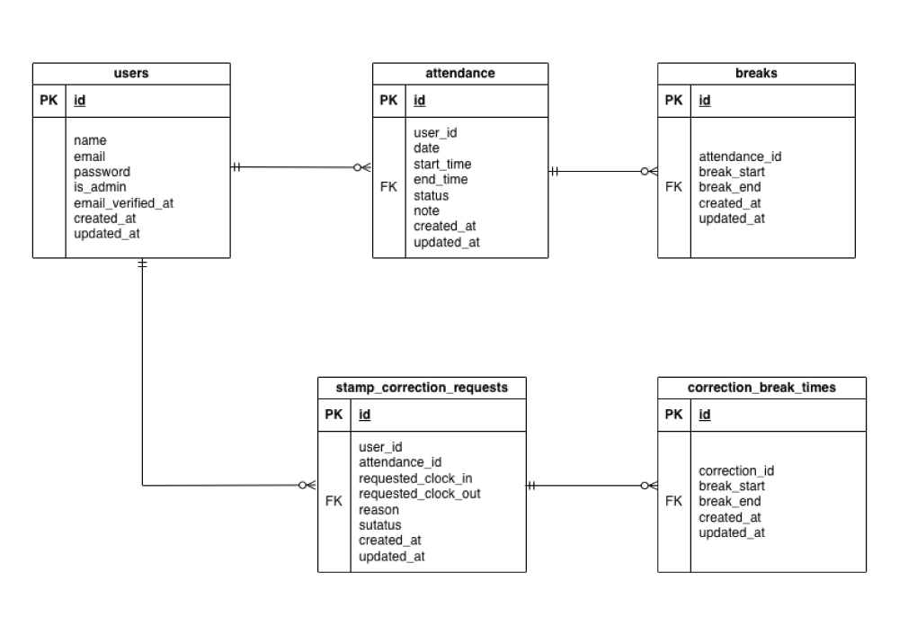

# 勤怠管理アプリ

Laravelで作成した勤怠管理アプリです。

---

## アプリ概要

一般ユーザーと管理者ユーザーが勤怠管理を行うためのアプリです。

一般ユーザーは出勤・退勤・休憩の打刻、勤怠一覧の確認、勤怠詳細の確認、勤怠修正申請を行うことができます。

管理者は全スタッフの勤怠情報の確認、スタッフ別の勤怠一覧確認、勤怠修正申請の確認・承認を行うことができます。

---

# 主な機能

## 一般ユーザー

・会員登録
・ログイン／ログアウト
・メール認証
・出勤打刻
・休憩開始
・休憩終了
・退勤打刻
・勤怠一覧表示
・勤怠詳細表示
・勤怠修正申請
・申請一覧表示

## 管理者

・管理者ログイン
・日次勤怠一覧表示
・スタッフ一覧表示
・スタッフ別勤怠一覧表示
・勤怠詳細表示
・修正申請一覧表示
・修正申請承認

---

# 使用技術

| 技術 | バージョン |
|--------|--------|
| PHP | 8.1.34 |
| Laravel | 8.83.29 |
| MySQL | 8.0.26 |
| Nginx | latest |
| Docker | Docker Compose |
| Laravel Fortify | 認証機能 |
| Mailhog | メール認証確認 |

---

# 環境構築

## 1. リポジトリをクローン

```
git clone https://github.com/TAKAMASA-otk/attendance-app.git
```

```
cd attendance-app
```

---

## 2. Docker起動

```
docker compose up -d --build
```

---

## 3. コンテナに入る

```
docker-compose exec php bash
```

---

## 4. Laravelセットアップ

```
cd src
composer install
cp .env.example .env
php artisan key:generate
php artisan migrate --seed
```

---

# .env設定

```env
DB_CONNECTION=mysql
DB_HOST=mysql
DB_PORT=3306
DB_DATABASE=laravel_db
DB_USERNAME=laravel_user
DB_PASSWORD=laravel_pass

MAIL_MAILER=smtp
MAIL_HOST=mailhog
MAIL_PORT=1025
MAIL_FROM_ADDRESS=test@example.com MAIL_FROM_NAME="Attendance App"

APP_TIMEZONE=Asia/Tokyo
```
---

# 実行方法

ブラウザで以下にアクセスしてください。
http://localhost

---

# ログイン情報

## 管理者ユーザー
メールアドレス：admin@example.com
パスワード：password

## 一般ユーザー
メールアドレス：user@example.com
パスワード：password

# テスト実行

```
docker compose exec php php artisan test
```

---

# ER図

本アプリケーションのデータベース構造は以下の通りです。



---

# データベース構造

| テーブル名 | 説明 |
| --- | --- |
| users | ユーザー情報 |
| attendances | 勤怠情報 |
| breaks | 休憩時間情報 |
| stamp_correction_requests | 勤怠修正申請情報 |
| correction_break_times | 修正申請時の休憩時間情報 |

---

# ディレクトリ構成

```
app
 ├ Http
 │  ├ Controllers
 │  └ Requests
 └ Models

database
 ├ migrations
 └ seeders

resources
 └ views

public
 ├ css
 └ images

routes
 └ web.php

tests
```
---

# 作者

Takamasa Otsuka
